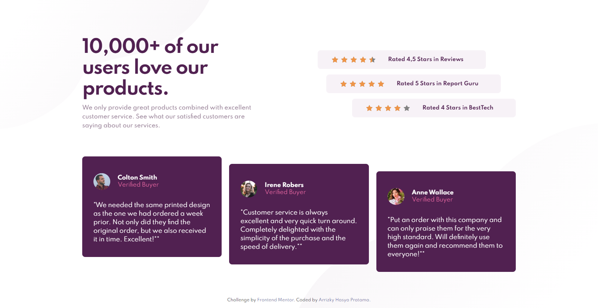

# Frontend Mentor - Social proof section solution

This is a solution to the [Social proof section challenge on Frontend Mentor](https://www.frontendmentor.io/challenges/social-proof-section-6e0qTv_bA). Frontend Mentor challenges help you improve your coding skills by building realistic projects.

## Table of contents

- [Overview](#overview)
  - [The challenge](#the-challenge)
  - [Screenshot](#screenshot)
  - [Links](#links)
- [My process](#my-process)
  - [Built with](#built-with)
- [Useful resources](#useful-resources)
- [Install](#install)
- [Author](#author)

## Overview

### The challenge

Users should be able to:

- View the optimal layout for the section depending on their device's screen size

### Screenshot

[📱 Mobile Version](./mobile.png)

### Links

- 📌 Solution URL: [Solution](https://github.com/arrizkyhp/fm-social-proof-section)
- 🎪 Live Site URL: [Live Site](https://arrizkyhp.github.io/fm-social-proof-section/)

## My process

### Built with

- CSS custom properties
- Flexbox
- CSS Grid
- BEM naming
- [Sass](https://sass-lang.com/) - CSS extension
- [GulpJS](https://gulpjs.com/) - JS library
- [ReactJS](https://reactjs.org/) - JS library

## Install

In the project directory, you can run:

### `npm start`

Runs the app in the development mode.
Open [http://localhost:3000](http://localhost:3000) to view it in the browser.

The page will reload if you make edits.
You will also see any lint errors in the console.

to start gulp js processing scss run:

### `gulp`

## Author

- Github - [arrizkyhp](https://github.com/arrizkyhp)
- Frontend Mentor - [@arrizkyhp](https://www.frontendmentor.io/profile/arrizkyhp)
- Twitter - [@arrizkyhp](https://twitter.com/arrizkyhp)
